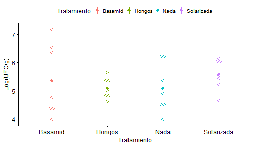
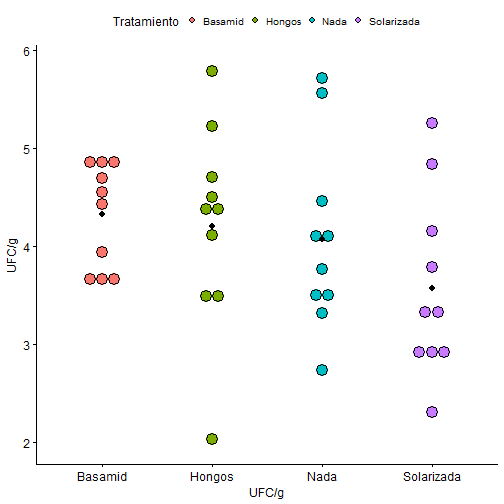
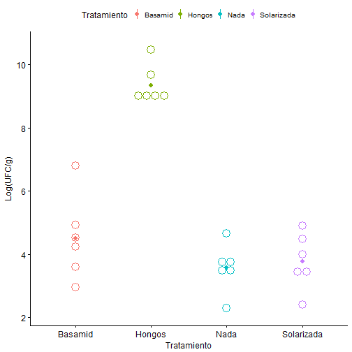
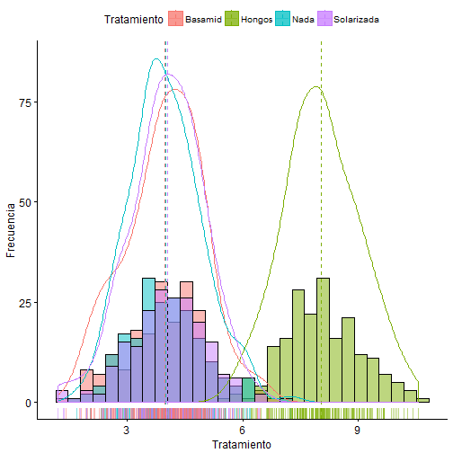
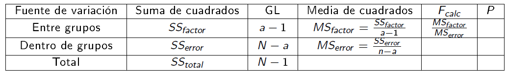
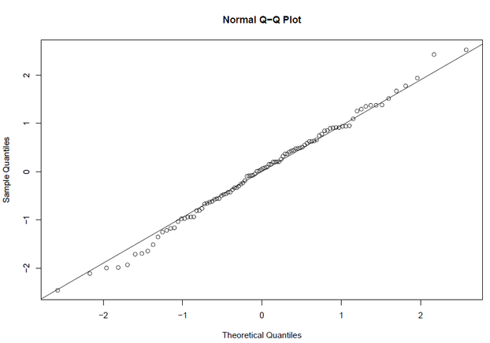

## Comparando dos grupos... 


--- 


## Introducción


---

## ANOVA unifactorial o de una vía 


---


## ANOVA unifactorial: Cuantitativa vs. categórica

 Se refiere a una clase de muestreo o diseños experimentales, en los   cuales la variable __predictora__ o __explicativa__ es   _categórica_ y la variable __respuesta__ es  __continua__.


---

## ANOVA unifactorial 

Se fundamenta en la descomposición de la variación de una variable _respuesta_ $\bar{Y}$, entre la varainza explicada  y no   explicada por uno o varios factores.
 
 <span style="display:block; height: 2cm;"></span>
 


---

## ANOVA unifactorial: Objetivo

<span style="display:block; height: 2cm;"></span>
El `ANOVA` tiene como objetivos centrales:


+ Examinar la contribución relativa de cada una de las fuentes de variación, a la variabilidad total de $\bar{y}$.

+ Probar la hipótesis nula $(H_0)$, que la __media__ de los grupos o tratamientos son iguales. 

---

## ANOVA: Una perspectiva gráfica
Cuando analizamos los datos usando análisis de varianza, el primer paso
es poner a prueba la hipótesis nula global:

\[ H_0: \mu_1 = \mu_2 = \mu_3= .. \mu_I\] contra


\[ H_a: \text{al menos una media difiere} \]




---

## ANOVA

> +  Comparamos la variación __dentro de cada grupo__ con la obtenidad __entre cada grupo__ para evaluar si existen diferencias significativas en las medias poblacionales. 

<span style="display:block; height: 2cm;"></span>

> + Por lo tanto, al comparar estas dos medidas de varianza entre sí, podemos detectar si hay verdaderas diferencias entre las medias de la población. 


---


## ANOVA: Comparando varianzas

Si la varianza __entre grupos__ es similar a la __dentro__ de los grupos: 




---

## ANOVA: Comparando varianzas

Si la varianza __entre grupos__ es similar a la __dentro__ de los grupos: 


---

## ANOVA: Comparando varianzas

Si la varianza __entre grupos__ es mucho mayor que la __dentro__ de los grupos: 




---

## ANOVA: Comparando varianzas

Si la varianza __entre grupos__ es mucho mayor que la __dentro__ de los grupos: 



---


## ANOVA: Particionando la varianza.... 

El ANOVA está construido sobre el concepto de partición de la
__suma de cuadrados__. La variación total en un conjunto de datos
puede ser expresada como suma de cuadarados __(SS)__: La diferencia
entre cada observación $(Y_i)$ y la gran media de los datos ($\bar{Y}$)
elevado al cuadrado y sumado.


\[\underbrace{Y_{ij}}_{Respuesta} = \underbrace{\bar{\mu}}_{\text{Media global}} + \underbrace{\tau_i}_{\text{Efecto del tto}} + \underbrace{e_{ij}}_{\text{Error aleatorio}} \]

<span style="display:block; height: 3cm;"></span>

\[ SS_{total}= SS_{factor}+ SS_{error} \]

---

## Notación.... 

  
  + $N$: número total de observaciones.
  + $i$: número de grupos.
  + $\bar{y}$: media general 'gran media'.
  
Cada grupo $i$ tiene: 
  
  + $n_i$: número de observaciones en el grupo $i$.
  + $y_{ij}$ = observación $j$ en el grupo $i$.
  +  $\bar{y}_i$: media del grupo $i$.
  + $s_i$: Desviación de estándar en el grupo $i$.

---

## ANOVA: Suma de cuadrados totales


\[SS_{total}=\sum_{i=1}^{a} \sum_{j=1}^{n} (Y_{ij} - \bar{Y})^2 \]

  <span style="display:block; height: 2cm;"></span>
Siendo, 
 $i$ = 1 hasta __a__ tratamientos ; $j$= 1 hasta __n__ réplicas.
 
  <span style="display:block; height: 2cm;"></span>
> Refleja la desviación de cada observación de la 'gran media'.

---

## ANOVA: Suma de cuadrados entre grupos 

\[SS_{factor}=\sum_{i=1}^{a} \sum_{j=1}^{n} (\bar{Y}_{i} - \bar{Y})^2 \]


> Representa la diferencia entre las medias de cada grupo o tratamiento con respcto a la media global.

---

## ANOVA: Suma de cuadrados dentro de grupos 

\[SS_{error}=\sum_{i=1}^{a} \sum_{j=1}^{n} (\bar{Y_{ij}} - \bar{Y_i})^2 \]


> Representa el error aleatorio o variación residual.

---

## ANOVA: Tabla ANOVA

  <span style="display:block; height: 4cm;"></span>


---

## ANOVA: Tabla ANOVA

  <span style="display:block; height: 4cm;"></span>

|            |  Df|   Sum Sq| Mean Sq| F value| Pr(>F)|
|:-----------|---:|--------:|-------:|-------:|------:|
|Tratamiento |   3| 2433.516| 811.172| 825.329|      0|
|Residuals   | 796|  782.346|   0.983|      NA|     NA|

---

## Comprobando Supuestos: Normalidad  

Suponemos que los __errores__ y __las observaciones__, 
dentro de cada grupo provienen de  poblaciones con distribución normal. 

<span style="display:block; height: 1cm;"></span>
     	 	 
> \[H_o: \text{Los residuales están normalmente distribuidos.} \]

<span style="display:block; height: 1cm;"></span>

		
> \[H_a: \text{Los residuales no  están normalmente distribuidos.} \]

<span style="display:block; height: 1cm;"></span> 

>La idea es no rechazar $H_o$ para asegurar el cumplimiento del supuesto.

---

## Normalidad: Validación gráfica mediante histogramas

Los histogramas, de forma, exploratoria nos permite determinar _simetría_ y 
_modalidad_ en nuestros datos.


---

## Normalidad: Validación gráfica mediante Q-Q plot
Los gráficos __cuantil-cuantil__ o __QQ plot__, nos permite contrastar nuestros datos con una distribución normal teórica.




---

## Normalidad: Validación gráfica mediante Q-Q plot
Los gráficos __cuantil-cuantil__ o __QQ plot__, nos permite contrastar nuestros datos con una distribución normal teórica.


---

## Normalidad: Validación mediante Pruebas

 + Shapiro - Wilks  - `shapiro.test()`

```r
residuos<-rnorm(100, mean = 5, sd = 3)
shapiro.test(residuos)
```

```
## 
## 	Shapiro-Wilk normality test
## 
## data:  residuos
## W = 0.98958, p-value = 0.6309
```


---

## Comprobando Supuestos: Homocedasticidad

Asumen que la varianza en la variable respuesta es la misma 
en cada nivel, o combinación de los niveles del factor o factores.

> \[H_o: \text{La varianza de $Y$ es igual en cada nivel del factor} \]

<span style="display:block; height: 1cm;"></span>

		
> \[H_a: \text{La varianza de $Y$ no es igual en cada nivel del factor.} \]

<span style="display:block; height: 1cm;"></span> 

>La idea es no rechazar $H_o$ para asegurar el cumplimiento del supuesto.

---


## Homocedasticidad: Validación gráfica mediante Box-plot


---

## Homocedasticidad: Validación gráfica model-plot


---

## Homocedasticidad: Validación mediante pruebas 
### Prueba de Bartlett - `bartlett.test()`
 

```
## 
## 	Bartlett test of homogeneity of variances
## 
## data:  count by spray
## Bartlett's K-squared = 25.96, df = 5, p-value = 9.085e-05
```

```
## Levene's Test for Homogeneity of Variance (center = median)
##       Df F value Pr(>F)
## group  2   0.046 0.9551
##       42
```

```
## Levene's Test for Homogeneity of Variance (center = median)
##       Df F value Pr(>F)
## group  5  1.4694 0.2219
##       39
```

```
## 
## 	Bartlett test of homogeneity of variances
## 
## data:  conformity by fcategory
## Bartlett's K-squared = 0.33858, df = 2, p-value = 0.8443
```

---


## Homocedasticidad: Validación mediante pruebas 
### Prueba de Levene - `LeveneTest()`
 

```
## Levene's Test for Homogeneity of Variance (center = median)
##       Df F value Pr(>F)
## group  2   0.046 0.9551
##       42
```

```
## Levene's Test for Homogeneity of Variance (center = median)
##       Df F value Pr(>F)
## group  5  1.4694 0.2219
##       39
```

```
## Levene's Test for Homogeneity of Variance (center = median)
##       Df F value Pr(>F)
## group  5  1.4694 0.2219
##       39
```

---

## Padoc

---
