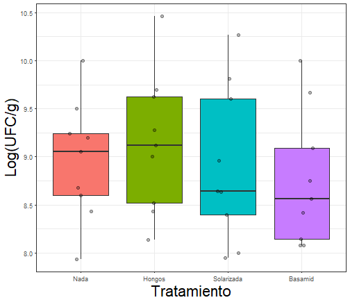

## Introducción

---

## ANOVA unifactorial o de una vía 

---

## ANOVA unifactorial: Cuantitativa vs. categórica

 Se refiere a una clase de muestreo o diseños experimentales, en los   cuales la variable __predictora__ o __explicativa__ es   _categórica_ y la variable __respuesta__ es  __continua__.

---

## ANOVA unifactorial 

Se fundamenta en la descomposición de la variación de una variable _respuesta_ $\bar{Y}$, entre la varainza explicada  y no   explicada por uno o varios factores.
 
 
 

---

## ANOVA unifactorial: Objetivo

El `ANOVA` tiene como objetivos centrales:

+ Examinar la contribución relativa de cada una de las fuentes de variación, a la variabilidad total de $\bar{y}$.

+ Probar la hipótesis nula $(H_0)$, que la __media__ de los grupos o tratamientos son iguales. 

---

## ANOVA: Una perspectiva gráfica
Cuando analizamos los datos usando análisis de varianza, el primer paso
es poner a prueba la hipótesis nula global:

\[ H_0: \mu_1 = \mu_2 = \mu_3= .. \mu_I\] contra

\[ H_a: \text{al menos una media difiere} \]

---

## ANOVA

> +  Comparamos la variación __dentro de cada grupo__ con la obtenidad __entre cada grupo__ para evaluar si existen diferencias significativas en las medias poblacionales. 

> + Por lo tanto, al comparar estas dos medidas de varianza entre sí, podemos detectar si hay verdaderas diferencias entre las medias de la población. 

---

## ANOVA: Comparando varianzas

Si la varianza __entre grupos__ es mucho mayor que la __dentro__ de los grupos: 

---

## ANOVA: Comparando varianzas

Si la varianza __entre grupos__ es mucho mayor que la __dentro__ de los grupos: 

---

## ANOVA: Comparando varianzas

Si la varianza __entre grupos__ es similar a la __dentro__ de los grupos: 

---

## ANOVA: Notación 

  + $N$: número total de observaciones.
  + $i$: número de grupos.
  + $\bar{y}$: media general 'gran media'.

Cada grupo $i$ tiene: 

	+ $n_i$: número de observaciones en el grupo $i$.
	+ $y_{ij}$ = observación _j_ en el grupo _i_
	+ $\bar{y}_i$: media del grupo $i$.
	+ $s_i$: Desviación de estándar en el grupo $i$.

---

## ANOVA: Particionando la varianza.... 

El ANOVA está construido sobre el concepto de partición de la
__suma de cuadrados__. La variación total en un conjunto de datos
puede ser expresada como suma de cuadarados __(SS)__: La diferencia
entre cada observación $(Y_i)$ y la gran media de los datos ($\bar{Y}$)
elevado al cuadrado y sumado.

\[\underbrace{Y_{ij}}_{Respuesta} = \underbrace{\bar{\mu}}_{\text{Media global}} + \underbrace{\tau_i}_{\text{Efecto del tto}} + \underbrace{e_{ij}}_{\text{Error aleatorio}} \]

\[ SS_{total}= SS_{factor}+ SS_{error} \]

---

## ANOVA: Suma de cuadrados totales

\[SS_{total}=\sum_{i=1}^{a} \sum_{j=1}^{n} (Y_{ij} - \bar{Y})^2 \]

  
Siendo, 
 $i$ = 1 hasta __a__ tratamientos ; $j$= 1 hasta __n__ réplicas.
 
  
> Refleja la desviación de cada observación de la 'gran media'.

---

## ANOVA: Suma de cuadrados entre grupos 

\[SS_{factor}=\sum_{i=1}^{a} \sum_{j=1}^{n} (\bar{Y}_{i} - \bar{Y})^2 \]

> Representa la diferencia entre las medias de cada grupo o tratamiento con respcto a la media global.

---

## ANOVA: Suma de cuadrados dentro de grupos 

\[SS_{error}=\sum_{i=1}^{a} \sum_{j=1}^{n} (\bar{Y_{ij}} - \bar{Y_i})^2 \]

> Representa el error aleatorio o variación residual.

---

## ANOVA: Tabla ANOVA

  

---

## ANOVA: Tabla ANOVA

  

|            |  Df|   Sum Sq| Mean Sq| F value| Pr(>F)|
|:-----------|---:|--------:|-------:|-------:|------:|
|Tratamiento |   3| 2520.128| 840.043| 849.073|      0|
|Residuals   | 796|  787.534|   0.989|      NA|     NA|

---

